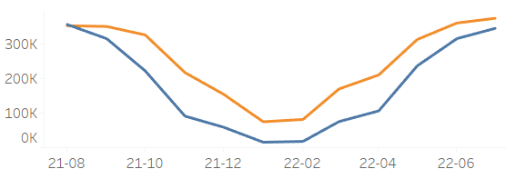
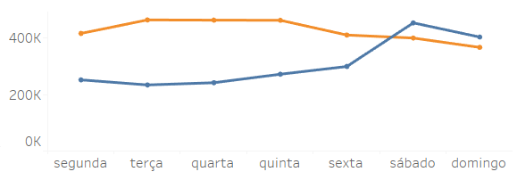

# Cyclistic Customers Insights (Under Development)

### Google Data Analytics Capstone: Cyclistic bike-share analysis

## 1. Abstract:

Cyclistic is a bike-sharing company located in Chicago and has over 5,800 bikes and 600 docking stations. 

The marketing director believes that the company's future success depends on maximizing the number of annual memberships. To that end, she wants to develop marketing strategies aimed at converting casual travelers into annual members.

In this way, this project goals to find insights into how do annual members and casual riders use Cyclistic bikes differently. 

The company's history from August 2021 to July 2022 was analyzed, in a **total of 5,733,030 rides records**, and the conclusions to be presented to the marketing director are available in a dashboard that can be accessed through this [**link**](https://public.tableau.com/views/CyclisticAnalysis_16628584053490/Painel1?:language=pt-BR&:display_count=n&:origin=viz_share_link).

**Key Words:** Google Data Analytics, Customer Insights, R, Tydiverse, Geosphere, Dplyr, Tableau, Dashboard

**Disclaimer:** Cyclistic is a fictitious company, according to the context presented in this project.

## 2. Methodology

Google certification in Data Analytics works with a methodology divided into 6 steps described below. The development of this project was guided by this framework.

## 3. Step 1: Ask

### 3.1 Context

In 2016, Cyclistic launched a successful bike-share offering. Since then, the program has grown to a fleet of 5,824 bicycles that are geotracked and locked into a network of 692 stations across Chicago. The bikes can be unlocked from one station and returned to any other station in the system anytime.

Until now, Cyclistic’s marketing strategy relied on building general awareness and appealing to broad consumer segments. One approach that helped make these things possible was the flexibility of its pricing plans: single-ride passes, full-day passes, and annual memberships. Customers who purchase single-ride or full-day passes are referred to as casual riders. Customers who purchase annual memberships are Cyclistic members.

Cyclistic’s finance analysts have concluded that annual members are much more profitable than casual riders. And now Lily Moreno, the marketing director, has set a clear goal: design marketing strategies aimed at converting casual riders into annual members.

In this way, this project goals to find insights into how do annual members and casual riders use Cyclistic bikes differently. This analysis will be done from a dataset that contains 12-month usage records: from August 2021 to July 2022.

### 3.2 Assumptions

To better define the scope of the analysis and avoid bias in the conclusions developed, the assumptions below were previously defined

* **Ride Duration:** only rides lasting at least 1 minute were considered.
* **Distance:** distances less than 1 meter and greater than 100 km were not considered in the analysis.
* **Speed:** the maximum average speed considered viable was 60km/h. Speeds above this value have a high chance of errors in the records and were therefore disregarded

## 4. Step 2: Prepare

### 4.1 Loading Data

[Cyclistic Historical Data](https://divvy-tripdata.s3.amazonaws.com/index.html)

### 4.2 Data Description

| Feature                | Description                                                                                               |
|------------------------|----------------------------------------------------------------------------------------------------------|
| Ride ID                | Unique identifier for each rider                                                                         |
| Rideable Type          | Bicicle type                                                                                             |
| Started At             | Date and time the ride started                                                                           |
| End At                 | Date and time the ride finished                                                                          |
| Start Station Name     | The name of the station from which the ride started                                                      |
| Start Station ID       | The ID of the station from which the ride started                                                        |
| End Station Name       | The name of the station from which the ride ended                                                        |
| End Station ID         | The ID of the station from which the ride ended                                                          |
| Start Lat              | The latitude of the station from which the ride started                                                  |
| Start Long             | The longitude of the station from which the ride started                                                 |
| End Lat                | The latitude of the station from which the ride ended                                                    |
| End Long               | The longitude of the station from which the ride ended                                                   |
| Member / Casual        | Rider type                                                                                               |

The complete code for this step is available [here](https://github.com/vitorhmf/customers-insights/blob/main/notebooks/v01_cyclistic_prepare.R).

## 5. Step 3: Process

### 5.1 Check and Fillout NA

* **Stations names and ids:** 14.5% of the records in the dataset were missing information about the name and id of the start and end stations. Simply deleting these records could generate a bias in the analysis, so the columns that contained this information were removed and the stations were defined by their latitude and longitude information.

### 5.2 Feature Engineering

* **Features from date:** date, month, day, year, day of week;
* **Features from rides:** duration (min), distance (km), speed (km/h);
* **Features from geo location:** start station, end station 

### 5.3 Data Filtering

* **Ride Duration:** only records with a duration greater than or equal to 1 minute were kept;
* **Distance:** records were kept with distances greater than 1 meter and less than 100 km;
* **Speed:** only records with average speeds below 60km/h were selected;

The complete code for this step is available [here](https://github.com/vitorhmf/customers-insights/blob/main/notebooks/v02_cyclistic_process.R).

## 6. Step 4: Analyze

### 6.1 Customer Types (Rides vs. Type):

### 6.2 Seasonality Analysis

* **Annual Seasonality (Rides vs. Month):**

The number of rides has a strong relationship with the climate of the region (described in the table below). In winter, for example, the number of records almost reaches zero. This fact proves the importance of increasing the number of annual members, this would reduce the impact of seasonality on the company's revenue.

| Season                 | Months                                 | Temperatures Range   |
|------------------------|----------------------------------------|----------------------|
| Winter                 | Dec, Jan, Feb                          | can reach -20°C      |
| Spring                 | Mar, Apr, May                          | 9°C to 21°C          |
| Summer                 | Jun, Jul, Aug                          | 17°C to 28°C         |
| Fall                   | Sep, Out, Nov                          | 7°C to 17°C          |

* **Weekly Seasonality (Rides vs. Day of Week):**

### 6.3 Rides Analysis:

## 7. Step 5: Share

[**Dashboard**](https://public.tableau.com/views/CyclisticAnalysis_16628584053490/Painel1?:language=pt-BR&:display_count=n&:origin=viz_share_link)

## 8. Step 6: Act

### 8.1 Actions

### 8.2. Next Steps

* **Geolocation:** the decision to eliminate the columns with the names and ids of the start and end stations avoided the elimination of more than 800,000 records (approximately 15% of the dataset), however, the use of geolocation to define the stations proved to be ineffective, as

## 10. References
